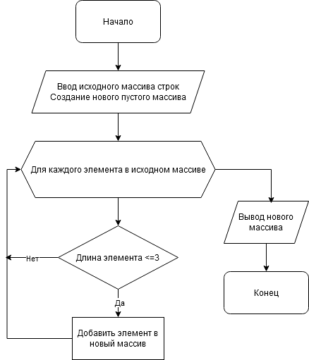

# Описание решения

## Представленная блок-схема описывает общий принцип решения задачи



Для решения поставленной задачи через код, необходимо реализовать два основных метода для определения и подсчета количества элементов в массивах, а также метод вывода массива на печать:

1. Метод "*DecideSizeNewArray*" вычисляет длину будущего массива на основе количества элементов исходного массива, удовлетворяющих условию - "*<= 3*".

```C#
int DecideSizeNewArray(string[] sar)
{
    int length = 0;
    foreach (string element in sar)
        if (element.Length <= 3) length++;

    return length;
}
```

2. Метод "*FormNewArray*" формирует новый массив строк из элементов, удовлетворяющих тому же условию  - "*<= 3*".

```C#
string[] FormNewArray(int size, string[] sar)
{
    int position = 0;
    string[] SolAr = new string[size];
    for (int i = 0; i < sar.Length; i++)
    {
        if (sar[i].Length <= 3)
        {
            SolAr[position] = sar[i];
            position++;
        }
    }

    return SolAr;
}
```

3. Метод "*PrintArray*" отображает выбранные по заданному условию элементы исходного массива.

```C#
void PrintArray(string[] sonar)
{
    Console.Write("[");
    Console.Write(string.Join(", ", sonar));
    Console.WriteLine("]");
}
```

Далее программа получает на вход исходный массив "*sourceArray*", задаваемый пользователем перед стартом программы, и массив "*newArray*" - который заполняется программой с использованием выше описанных методов.
